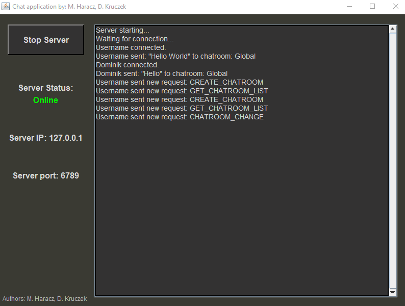
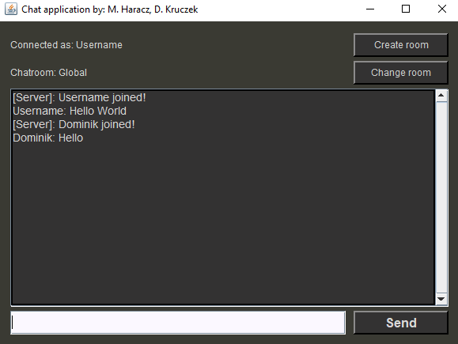
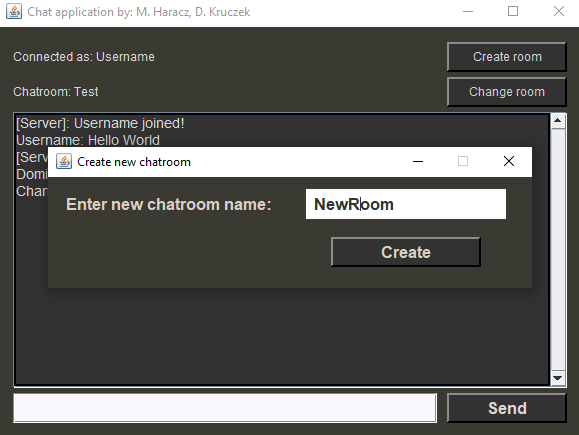
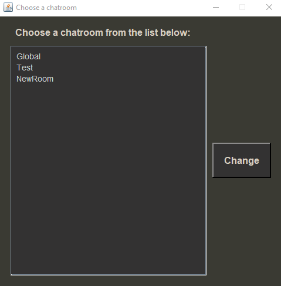
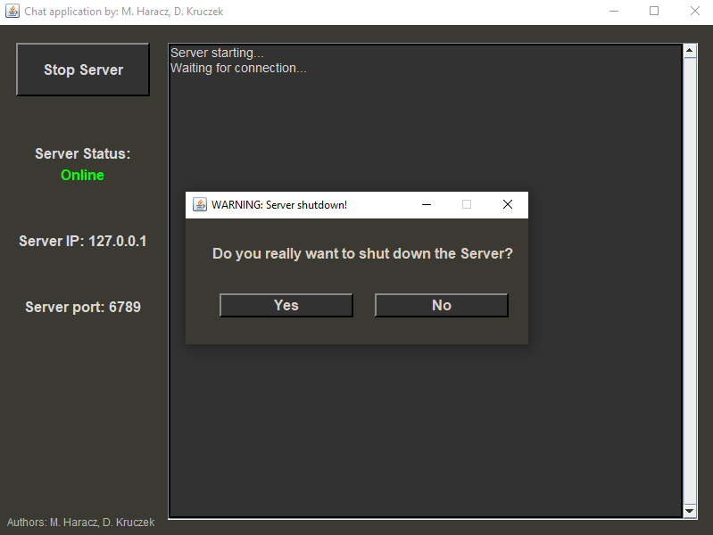

# GroupChat

Application for chatting written in Java. It contains server instance responsible for managing messaging and client instance for connecting and chatting.
It supports multiple users and unique chatrooms. It allows users to create new chatrooms. 

## Demo

### IMPORTANT - Currently the server only works locally.
If you want to host it yourself you need to change [Server Socket](Server/src/MainApp.java#L38) to assign machine IP instead.\
To do it change ServerSocket constructor to [this](https://docs.oracle.com/javase/7/docs/api/java/net/ServerSocket.html#ServerSocket(int,%20int,%20java.net.InetAddress))

For the client change [connection data](Client/src/ChatWindow.java#L153) to Server's IP.\
You can just type it in or modify [Username Frame](Client/src/UsernameFrame.java) to accept it in from textBox, then pass it through the constructor.

Lastly you need to configure your network accordingly to allow the flow of traffic.

[Client Executable](Client/Client.jar) - Requires Java!\
[Server Executable](Server/Server.jar) - Requires Java!

## Documentation

[Client Documentation](Client/Documentation/)\
[Server Documentation](Server/Documentation/)

## Screenshots

## Features

- Chat server.
- Chat client.
- Ability to create and manage chat groups.
- Log's displayed in the server window.
- Each user has its own thread.
- Custom Swing styling.

## Technologies

- Java
- Swing
- Sockets
- Multithreading

## Authors

- [@dkrucze](https://github.com/TheKiromen)
- [@mharacz](https://github.com/mharacz)
